# Build Process: How LinoPress Creates a WordPress Site

This document traces exactly what happens when you run a build command like:

```bash
node dist/cli.js build motorcycle-shop \
  --prompt "Create a website for a motorcycle shop selling Harleys. It is not a webshop, but they want to present what they have in store." \
  --port 8089 \
  --browser
```

---

## High-Level Overview

The build pipeline has 9 sequential steps. Each step either runs an AI agent with a specific skill or performs a direct infrastructure operation.

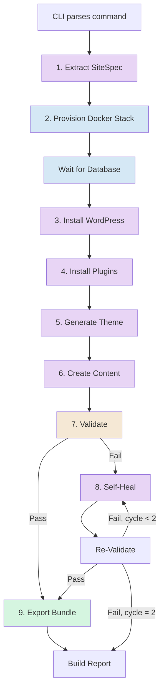

**Legend:** Purple = AI agent step, Blue = infrastructure step, Orange = validation, Green = export.

---

## Step 0: CLI Parsing

**Source:** `src/cli.ts`

The CLI parses the command into a `BuildOrchestratorInput`:

| Argument          | Value            | Effect                                                        |
| ----------------- | ---------------- | ------------------------------------------------------------- |
| `motorcycle-shop` | Site ID          | Used as Docker project name, container prefix, directory name |
| `--prompt "..."`  | Natural language | Triggers the LLM extraction step to generate a SiteSpec       |
| `--port 8089`     | Port             | WordPress will be accessible at `http://localhost:8089`       |
| `--browser`       | Flag             | Starts a headless Chrome container for visual validation      |

The CLI calls `buildFromInput(input)` which wraps the pipeline in an optional global timeout, then calls `runBuild(input)`.

---

## Step 1: Extract SiteSpec from Prompt

**Type:** AI Agent step (separate runtime)
**Skill:** `site-spec-extractor`
**Source:** `src/build/orchestrator.ts` -> `extractSiteSpecFromPrompt()`

This step only runs when `--prompt` is provided (skipped if `--spec` is used). A dedicated agent runtime is created, and the LLM is asked to convert the free-text prompt into a structured `SiteSpec` JSON.

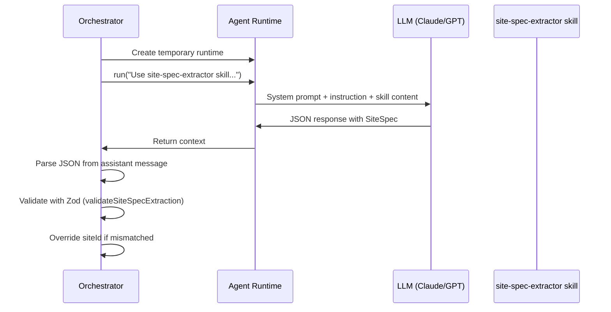

For our motorcycle shop prompt, the LLM would produce something like:

```json
{
  "siteSpec": {
    "prompt": "Create a website for a motorcycle shop selling Harleys...",
    "siteId": "motorcycle-shop",
    "themeMode": "parent",
    "styleSeed": "bold, dark tones, industrial feel, Harley-Davidson aesthetic",
    "plugins": ["contact-form-7"],
    "pages": [
      { "title": "Home", "slug": "home" },
      { "title": "Our Bikes", "slug": "our-bikes" },
      { "title": "About Us", "slug": "about-us" },
      { "title": "Contact", "slug": "contact" }
    ],
    "language": "en_US",
    "timezone": "UTC",
    "business": {
      "name": "Motorcycle Shop",
      "description": "Harley-Davidson dealer showcasing in-store inventory"
    }
  },
  "warnings": [],
  "inferredDefaults": ["timezone", "language", "permalinkStructure"],
  "confidence": 0.85,
  "ambiguities": ["Business name not specified in prompt"]
}
```

The extraction result is validated against a Zod schema. The `siteId` is forced to match the CLI argument. Default `permalinkStructure` is set to `/%postname%/` if not specified.

---

## Step 2: Provision Docker Stack

**Type:** Infrastructure step (no agent)
**Source:** `src/stack/provision.ts` -> `provisionStack()`

This creates the entire Docker infrastructure for the site.

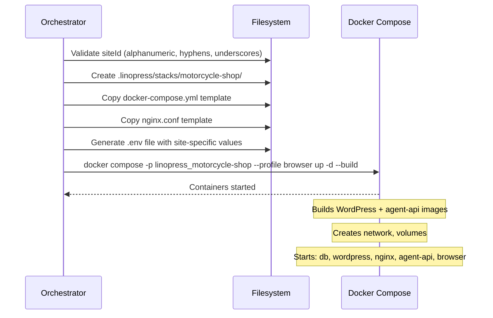

### What gets created

**Directory structure:**

```
.linopress/stacks/motorcycle-shop/
  docker-compose.yml    # Copied from docker/ template
  nginx.conf            # Copied from docker/ template
  .env                  # Generated with site-specific values
```

**Docker resources:**

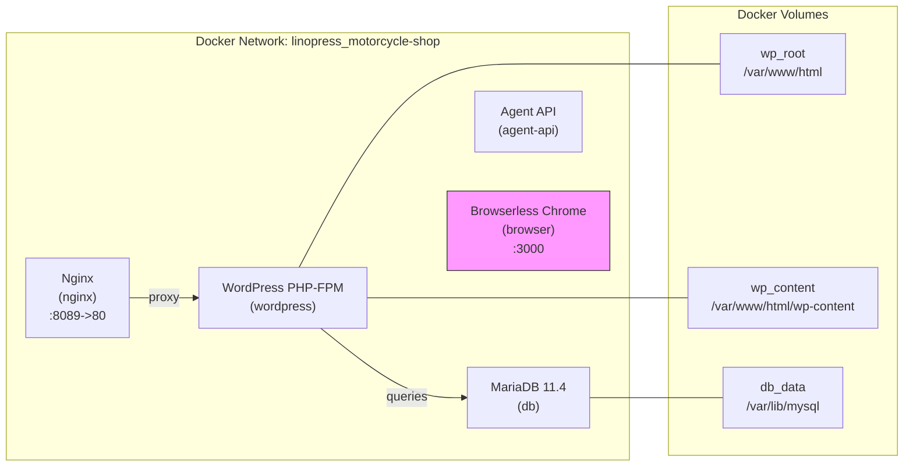

The browser container (pink) only starts because `--browser` was passed. Without it, only the 4 core services run.

**Generated `.env` values:**

```
LINOPRESS_ROOT=/Users/you/projects/linopress
WP_STACK_PORT=8089
WP_DB_NAME=linopress_motorcycle-shop
WP_DB_USER=wp_motorcycle-shop
WP_DB_PASSWORD=linopress_motorcycle-shop
DB_ROOT_PASSWORD=linopress-root
WP_HOME=http://localhost:8089
WP_SITEURL=http://localhost:8089
BROWSER_PORT=3000
```

### Database Readiness Wait

After provisioning, the orchestrator polls MariaDB by running `wp db check` every 2 seconds, up to 60 seconds. This prevents the next step from failing because the database hasn't finished initializing.

```
[build] Waiting for database readiness...
[build] Database ready
```

---

## Step 3: Install WordPress

**Type:** AI Agent step
**Skill:** `wp-install`
**Tools used:** `wp_cli`, `file`

The orchestrator sends an instruction to the agent like:

> "Use the wp-install skill to install and configure WordPress for this site. Site spec: { ... }"

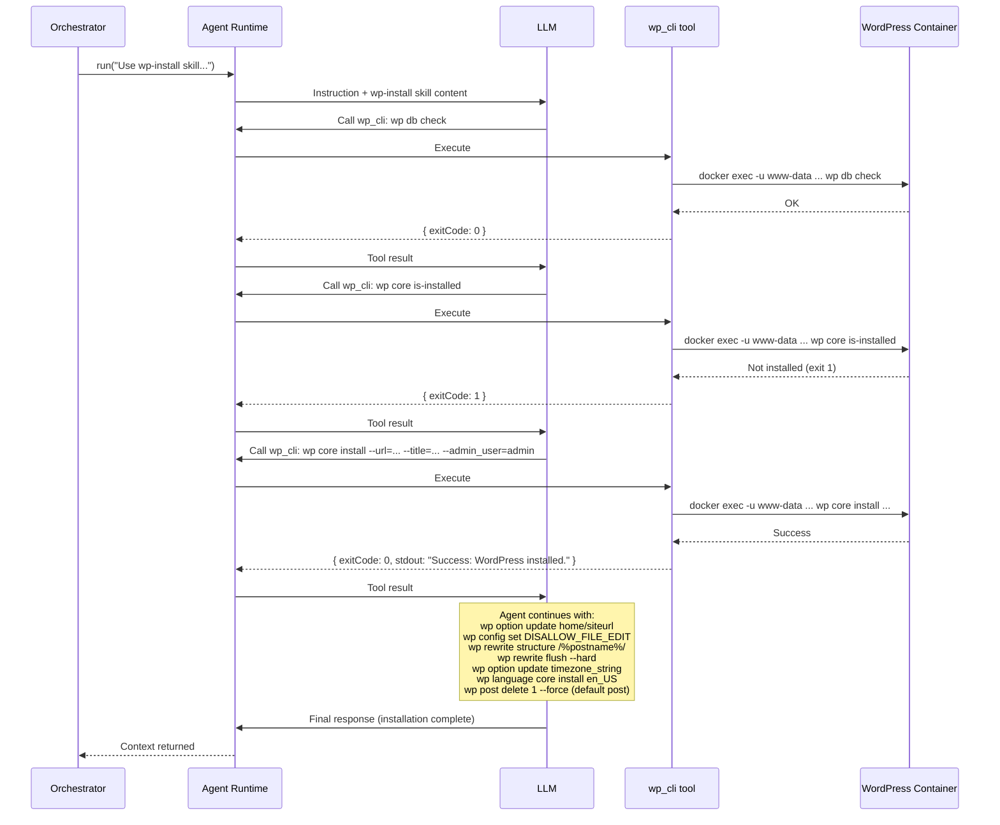

### What the agent does (guided by the wp-install skill)

1. **Check database** -- `wp db check` to confirm connectivity
2. **Check if installed** -- `wp core is-installed`
3. **Install WordPress** -- `wp core install` with URL, title, admin credentials
4. **Configure URLs** -- `wp option update home` and `siteurl` to `http://localhost:8089`
5. **Security** -- `wp config set DISALLOW_FILE_EDIT true --raw`
6. **Permalinks** -- `wp rewrite structure /%postname%/` + `wp rewrite flush --hard`
7. **Locale** -- `wp option update timezone_string`, `wp language core install en_US`
8. **Cleanup** -- Delete default "Hello World" post

---

## Step 4: Install Plugins

**Type:** AI Agent step (conditional -- skipped if no plugins in SiteSpec)
**Skill:** `plugin-installer`
**Tools used:** `wp_cli`

The agent installs and activates each plugin from the SiteSpec's `plugins[]` array.

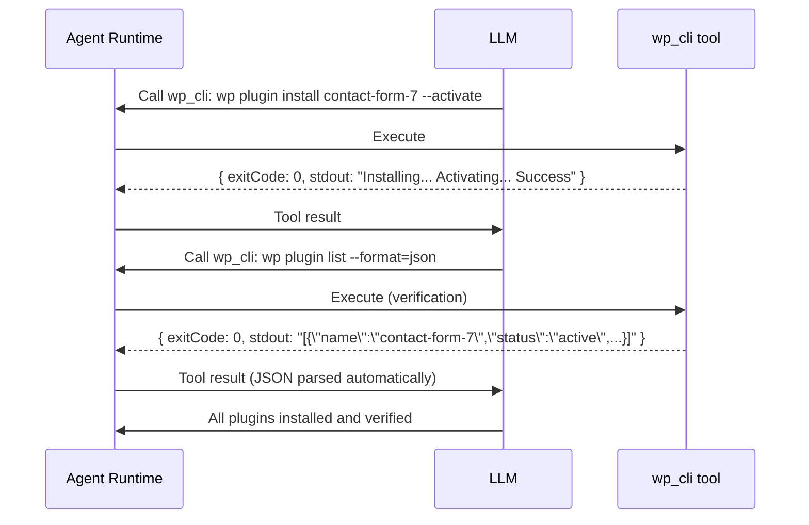

The plugin-installer skill handles dependency ordering, compatibility checks, and has rollback logic if activation fails.

---

## Step 5: Generate Theme

**Type:** AI Agent step
**Skill:** `theme-generator`
**Tools used:** `wp_cli`, `file`

Based on the `themeMode` in the SiteSpec, the agent creates the theme. For our motorcycle shop with `themeMode: "parent"`:

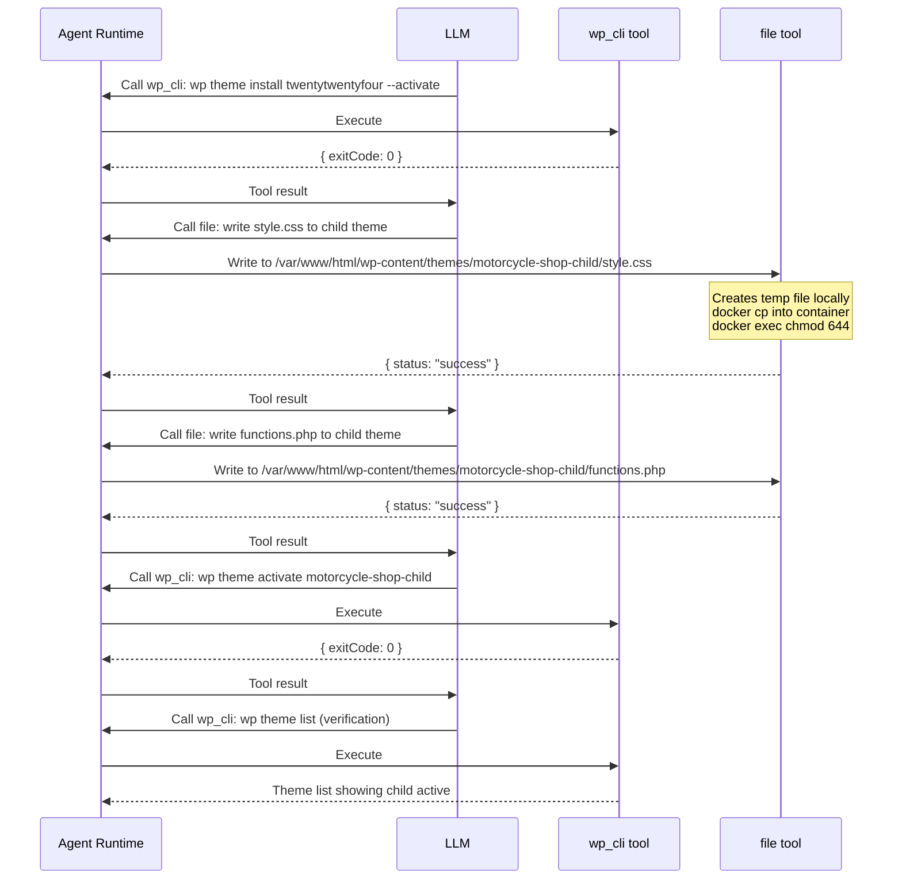

### Theme Modes

| Mode            | What happens                                                                                                                             |
| --------------- | ---------------------------------------------------------------------------------------------------------------------------------------- |
| `parent`        | Installs a curated parent theme (e.g. twentytwentyfour), creates a child theme with `style.css` and `functions.php`, activates the child |
| `blank`         | Creates a full block theme from scratch with `theme.json`, templates, patterns                                                           |
| `user-selected` | Installs a specific theme slug from the WordPress directory                                                                              |

The `styleSeed` from the SiteSpec ("bold, dark tones, industrial feel") guides the LLM's CSS choices for the child theme.

---

## Step 6: Create Content

**Type:** AI Agent step (conditional -- skipped if no pages in SiteSpec)
**Skill:** `page-builder`
**Tools used:** `wp_cli`

The agent creates all pages, sets up navigation menus, and configures the homepage.

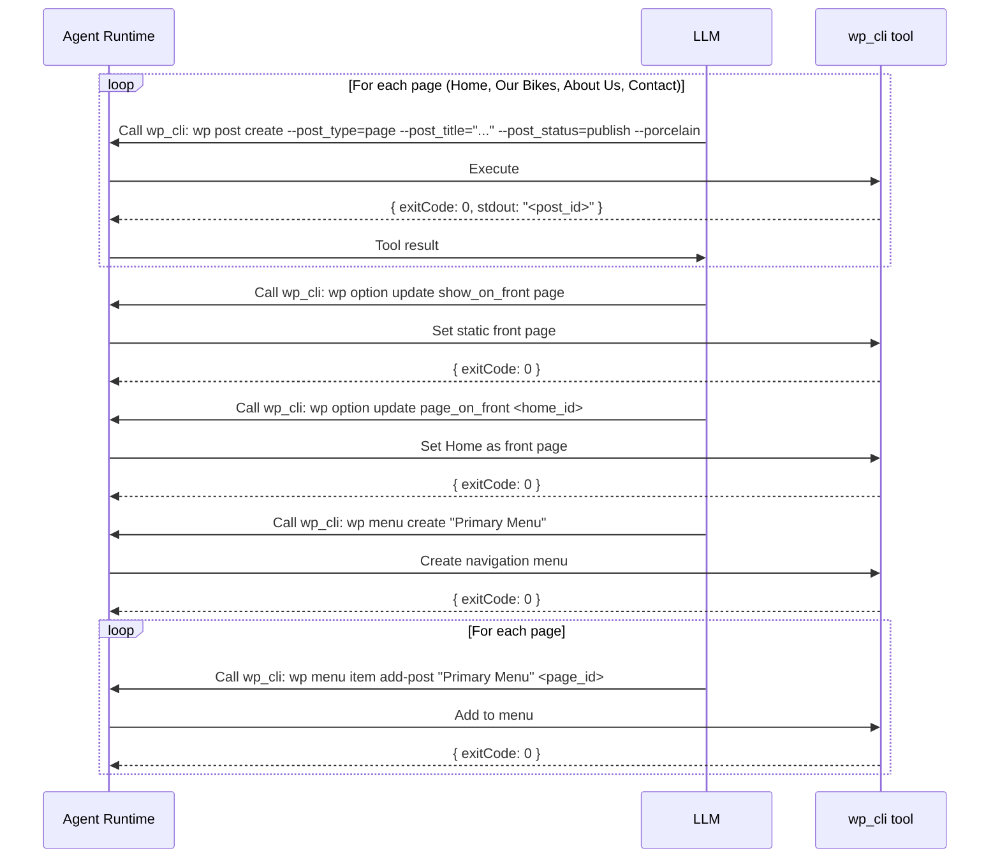

The page-builder skill instructs the agent to use WordPress block markup (Gutenberg blocks) for page content, create hierarchical menus, and assign menu locations.

---

## Step 7: Validate

**Type:** Direct infrastructure calls (no agent)
**Source:** `src/build/orchestrator.ts` -> `buildValidation()`

Validation runs two tracks: CLI validation (always) and browser validation (when `--browser` is enabled).

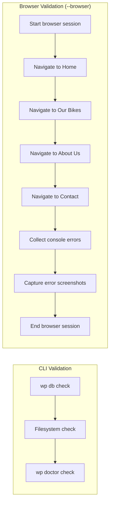

### CLI Validation

| Check      | Command           | Pass condition                        |
| ---------- | ----------------- | ------------------------------------- |
| Database   | `wp db check`     | Exit code 0                           |
| Health     | `wp doctor check` | Exit code 0, or command not available |
| Filesystem | Mirrors DB result | Same as database                      |

CLI checks retry up to 3 times with 2-second intervals.

### Browser Validation

The headless Chrome container navigates to each page URL derived from the SiteSpec:

- `http://localhost:8089/`
- `http://localhost:8089/our-bikes/`
- `http://localhost:8089/about-us/`
- `http://localhost:8089/contact/`

For each page, it collects:

- **Console errors** (JavaScript exceptions, failed resource loads)
- **Network errors** (HTTP responses with status >= 400)
- **Screenshots** (automatically captured when errors are detected)

Validation **passes** when all CLI checks succeed AND there are zero browser console errors.

---

## Step 8: Self-Heal (Conditional)

**Type:** AI Agent step (only runs if validation failed and `--no-heal` was not set)
**Skill:** `self-healing`
**Tools used:** `wp_cli`, `file`, `browser`, `export`
**Max cycles:** 2

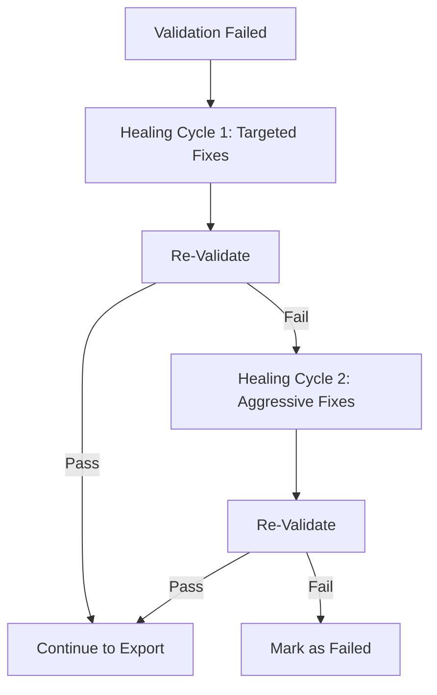

The self-healing skill classifies errors by type and applies targeted fixes:

| Error Type       | Cycle 1 (Targeted)                      | Cycle 2 (Aggressive)                   |
| ---------------- | --------------------------------------- | -------------------------------------- |
| Database         | `wp db repair`                          | Recreate admin user                    |
| Filesystem       | Reset permissions (755 dirs, 644 files) | Full permission reset                  |
| Plugin conflict  | Deactivate problematic plugin           | Deactivate all, re-activate one by one |
| Theme error      | Fix child theme files                   | Fall back to twentytwentyfour          |
| Missing content  | Recreate missing pages                  | Invoke page-builder skill              |
| Permalink errors | `wp rewrite flush --hard`               | Rebuild `.htaccess`                    |

---

## Step 9: Export Bundle

**Type:** Direct infrastructure call (no agent)
**Source:** `src/tools/export-exec.ts` -> `createExportExecutor()`

Only runs if final validation passed. Creates a portable `.tar.gz` bundle.

```mermaid
sequenceDiagram
    participant O as Orchestrator
    participant E as Export Executor
    participant C as WordPress Container
    participant FS as Filesystem

    O->>E: Execute export
    E->>FS: Create exports/motorcycle-shop/.tmp-export-<ts>/

    par Archive wp-content
        E->>C: docker exec -u www-data ... tar -czf - wp-content
        C-->>FS: wp-content.tar.gz
    and Export database
        E->>C: docker exec -u www-data ... wp db export -
        C-->>FS: database.sql
    end

    E->>FS: Validate SQL (has CREATE TABLE + INSERT INTO)
    E->>FS: Scan for secrets (API keys, passwords)
    E->>C: wp core version (get WP version)
    E->>C: php -r 'echo PHP_VERSION;'
    E->>C: wp plugin list --format=json
    E->>C: wp theme list --status=active --format=json

    E->>FS: Build manifest.json
    E->>FS: Assemble bundle directory
    Note over FS: wp-content/<br/>database.sql<br/>manifest.json<br/>screenshots/ (if any)

    E->>FS: tar -czf site-motorcycle-shop_<ts>.tar.gz
    E->>FS: Validate bundle (has wp-content/, database.sql, manifest.json)
    E->>FS: Atomic rename (.tmp -> final)
    E->>FS: Check size (warn if > 500MB)
    E->>FS: Cleanup temp directory

    E-->>O: { status: "success", bundlePath, sizeBytes, manifest }
```

### Bundle contents

```
site-motorcycle-shop_2026-02-17T11-30-00-000Z.tar.gz
  wp-content/
    themes/
      motorcycle-shop-child/
        style.css
        functions.php
    plugins/
      contact-form-7/
        ...
  database.sql
  manifest.json
  screenshots/        (if browser validation captured any)
```

---

## The Agent Runtime: How Skills and Tools Work Together

Each AI agent step uses the same runtime, which is a sisu `Agent` with a 10-layer middleware stack.

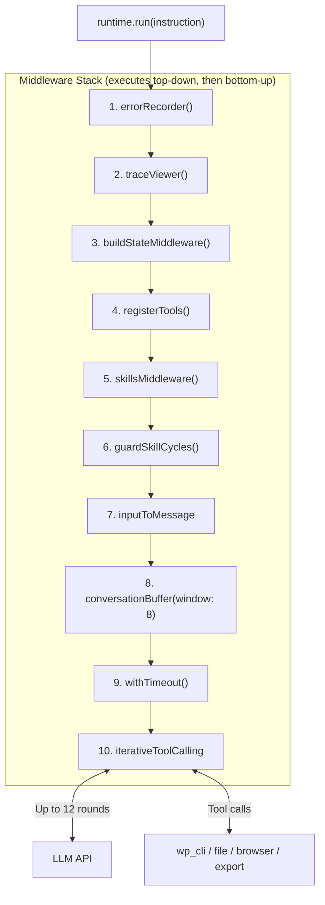

### The Iterative Tool Calling Loop

This is the core of each agent step. The LLM and tools interact in a loop:

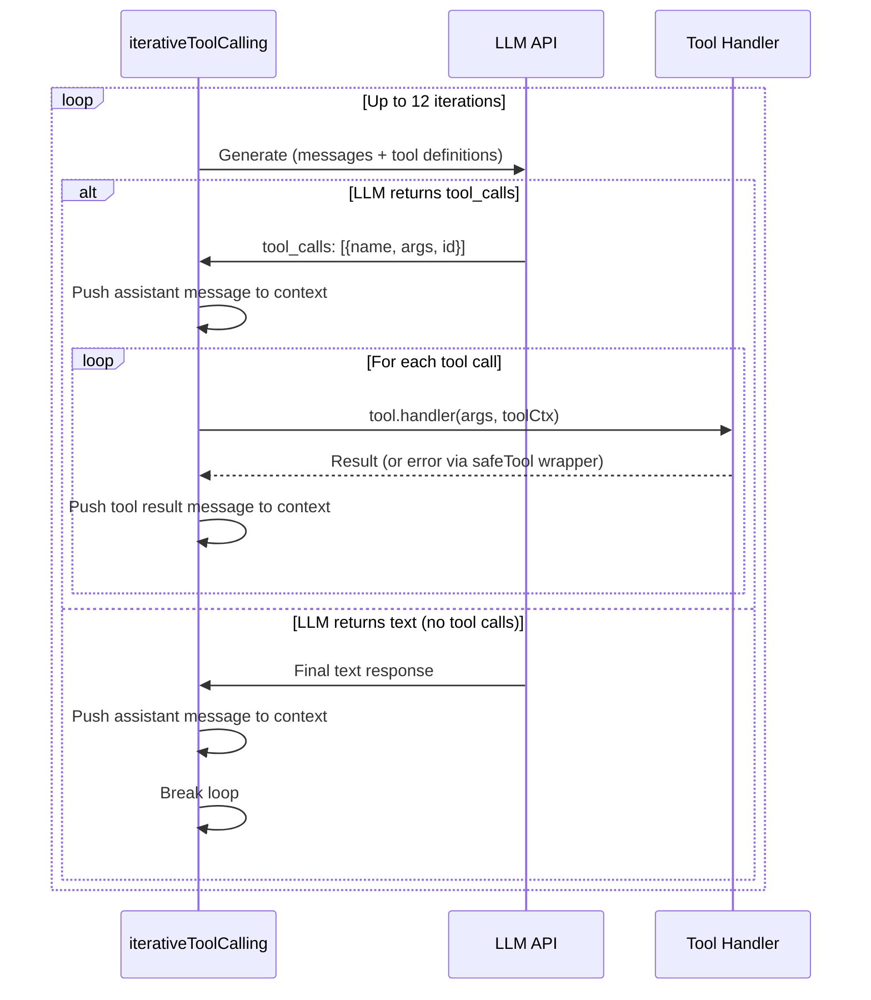

### The safeTool Wrapper

All tool handlers are wrapped with `safeTool()` which catches any thrown errors and returns them as structured error messages. This prevents a single tool failure from crashing the entire agent run:

```
Tool throws Error("Container not found")
  -> safeTool catches it
  -> Returns { status: "error", error: "Container not found" }
  -> LLM sees this as a tool result and can adapt
```

---

## Error Handling: Defense in Depth

Errors are caught at four levels, preventing any single failure from crashing the entire build:

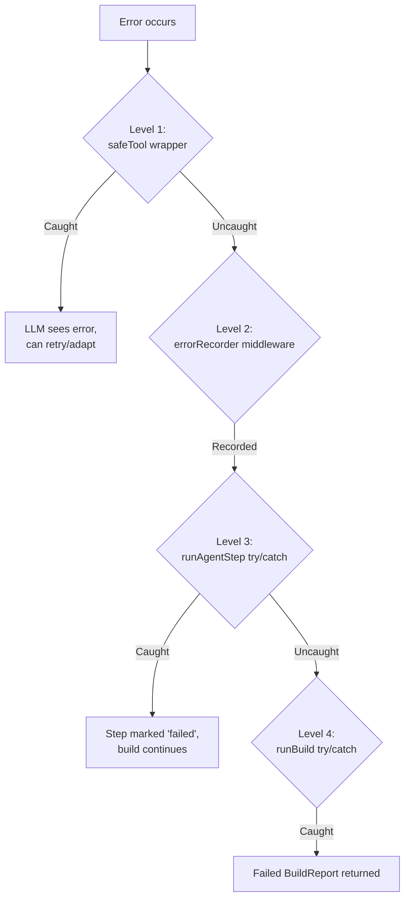

| Level            | Where                                           | What it does                                                |
| ---------------- | ----------------------------------------------- | ----------------------------------------------------------- |
| **Tool handler** | `safeTool()` in `src/agent/tools.ts`            | Catches tool errors, returns error object to LLM            |
| **Middleware**   | `errorRecorder()` in `src/agent/runtime.ts`     | Records error in build state, re-throws                     |
| **Build step**   | `runAgentStep()` in `src/build/orchestrator.ts` | Catches agent errors, marks step as failed, build continues |
| **Pipeline**     | `runBuild()` in `src/build/orchestrator.ts`     | Catches catastrophic errors, returns failed BuildReport     |

---

## Build Report

When the pipeline completes, a `BuildReport` is returned with:

```
Build status: success
Steps: 9/9 complete
```

The report includes:

- **status** -- `success` or `failed`
- **steps[]** -- Each step with status, timestamps, duration
- **validation** -- CLI results (databaseOk, filesystemOk, healthCheckOk) + browser results
- **screenshots[]** -- Paths to any captured screenshots
- **errors[]** -- Any errors encountered during the build
- **metadata** -- WordPress version, PHP version, active theme, installed plugins, total duration
- **healingCycles[]** -- Details of any self-healing attempts
- **export** -- Bundle path, size, manifest (if export succeeded)

---

## Complete Timeline

For a typical build like our motorcycle shop, the approximate timeline looks like:

```
 0s   CLI parses arguments
 1s   [extract]   LLM converts prompt to SiteSpec (~5s)
 6s   [provision] Docker stack spins up (~8s)
14s   [db-wait]   Poll until MariaDB ready (~2-4s)
18s   [install]   Agent installs WordPress (~20s, ~10 WP-CLI calls)
38s   [plugins]   Agent installs plugins (~5s per plugin)
43s   [theme]     Agent creates child theme (~15s, file writes + activation)
58s   [content]   Agent creates pages + menus (~20s, ~8 WP-CLI calls)
78s   [validate]  CLI checks + browser navigation (~10s)
88s   [heal]      (skipped if validation passes)
88s   [export]    Archive wp-content + DB, build bundle (~10s)
98s   Done. BuildReport returned.
```

Total: ~90-120 seconds for a typical site with 4-6 pages.

---

## File Reference

| File                          | Role in build pipeline                                              |
| ----------------------------- | ------------------------------------------------------------------- |
| `src/cli.ts`                  | Entry point, argument parsing, dispatches to orchestrator           |
| `src/build/orchestrator.ts`   | Pipeline controller, runs all 9 steps in sequence                   |
| `src/agent/runtime.ts`        | Creates agent with middleware stack, LLM adapter, tools             |
| `src/agent/tools.ts`          | Assembles toolset (wp_cli, file, browser, export), safeTool wrapper |
| `src/stack/provision.ts`      | Docker stack creation (compose, env, volumes)                       |
| `src/tools/wp-cli.ts`         | WP-CLI tool definition, command allowlist, arg sanitization         |
| `src/tools/wp-cli-exec.ts`    | Executes WP-CLI via `docker exec -u www-data`                       |
| `src/tools/file-tool.ts`      | File operations inside containers (read, write, copy, delete)       |
| `src/tools/browser-tool.ts`   | Browser tool definition, URL allowlist                              |
| `src/tools/browser-exec.ts`   | Headless Chrome operations via browserless container                |
| `src/tools/export-tool.ts`    | Export tool definition, manifest builder                            |
| `src/tools/export-exec.ts`    | Bundle creation (archive, DB dump, manifest, tarball)               |
| `src/tools/docker.ts`         | Low-level `child_process.spawn` wrapper for Docker commands         |
| `skills/site-spec-extractor/` | Skill: convert prompt to SiteSpec JSON                              |
| `skills/wp-install/`          | Skill: install and configure WordPress                              |
| `skills/plugin-installer/`    | Skill: install and activate plugins                                 |
| `skills/theme-generator/`     | Skill: create/install themes                                        |
| `skills/page-builder/`        | Skill: create pages, posts, and menus                               |
| `skills/site-validator/`      | Skill: validate site health                                         |
| `skills/browser-smoke-test/`  | Skill: browser-based validation                                     |
| `skills/self-healing/`        | Skill: diagnose and fix issues                                      |
| `skills/export-bundle/`       | Skill: export orchestration                                         |
